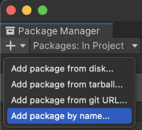

# Installation

Follow the following steps to install `com.unity.sharp-zip-lib` package:

1. Make sure git is installed in the system.
1. Open [Package Manager](https://docs.unity3d.com/Manual/upm-ui.html)
1. Click the **+** button, and choose **Add package from git URL**  
   
1. Type in `com.unity.sharp-zip-lib` and click **Add**.   
   We can also specify a particular version by appending `@<version>`, for example: `com.unity.sharp-zip-lib@1.3.5-preview`

